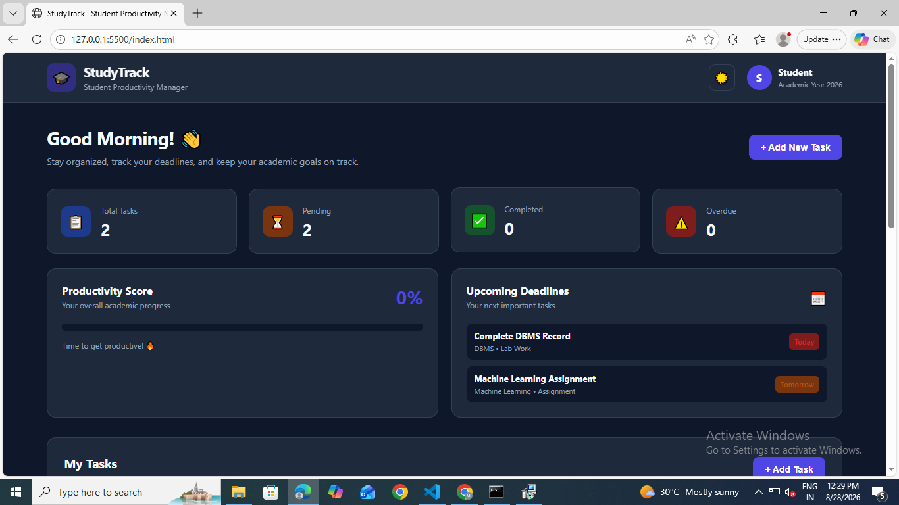

# 🎓 StudyTrack – Student Productivity Manager

<p align="center">
  <b>A modern academic productivity dashboard designed to help students manage tasks, deadlines, priorities, and study progress.</b>
</p>

<p align="center">
  
</p>

---

## 📌 Overview

Students often manage assignments, laboratory records, projects, examinations, and study activities across different platforms or manually maintained schedules.

This can make it difficult to:

- Keep track of upcoming deadlines
- Identify overdue academic work
- Prioritize important tasks
- Monitor completed work
- Understand overall academic progress

**StudyTrack** solves this problem by providing a centralized student productivity dashboard where academic tasks can be created, organized, prioritized, completed, and monitored.

---

## ✨ Features

### 📊 Productivity Dashboard

Get an instant overview of your academic workload.

- Total tasks
- Pending tasks
- Completed tasks
- Overdue tasks
- Productivity percentage
- Visual progress indicator

---

### 📝 Academic Task Management

Create and manage tasks with detailed information.

Each task can contain:

- Task title
- Description
- Subject
- Category
- Deadline
- Priority

Supported categories:

- 📚 Assignment
- 🧪 Lab Work
- 💻 Project
- 📝 Exam
- 📖 Study
- 📌 Other

---

### 🚦 Priority Management

Tasks can be classified based on importance:

| Priority | Meaning |
|----------|---------|
| 🔴 High | Important or urgent |
| 🟡 Medium | Normal academic work |
| 🟢 Low | Lower-priority activities |

---

### ⏰ Deadline Tracking

StudyTrack automatically identifies task deadlines.

It provides information such as:

- Due today
- Due tomorrow
- Upcoming deadlines
- Overdue tasks

---

### 🔍 Search & Filtering

Quickly find specific academic tasks using:

- Task search
- Subject search
- Category filtering
- Pending filter
- Completed filter
- Overdue filter
- High-priority filter

---

### 📈 Productivity Score

The application calculates a productivity score based on completed tasks.

Example:

```text
Completed Tasks / Total Tasks × 100
